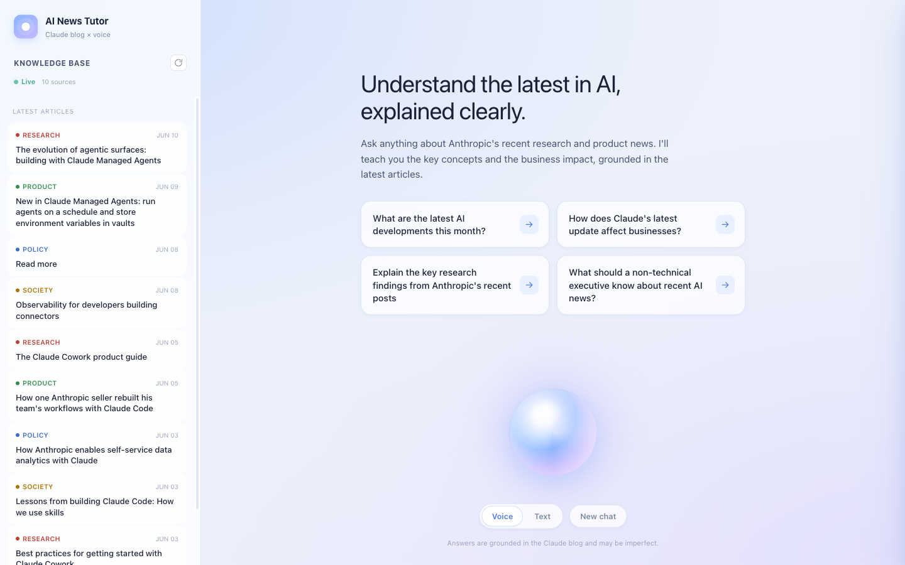

# AI News Tutor

**Understand the latest in AI — explained clearly, and read aloud.**

AI News Tutor is a conversational agent that turns the [Claude blog](https://claude.com/blog)'s latest posts into clear, on-demand explanations. Ask by voice or text. You can steer any answer to the level you want — high-level business impact or under-the-hood technical detail. Answers are streamed in and **read back aloud while the words highlight and the page follows along**, synced with real ElevenLabs timestamps.

**▶ Try it live: [ai-tutor-elevenlabs.vercel.app](https://ai-tutor-elevenlabs.vercel.app)**



---

## Who it's for

Founders, curious product managers or engineers — anyone interested in AI. Steer the conversation just by using your voice whether you want the business headline or the technical specifics.

## What it solves

AI moves faster than most people can keep up with, and primary sources are written for builders. AI News Tutor closes that gap:

- **Always current** — answers are grounded in every recent post the Claude blog surfaces, auto-refreshed daily and stored durably, not a stale training cutoff.
- **Speaks at your level** — it makes complex AI topics approachable for anyone, and because the chat is fully interactive it explains them in whatever register you ask for: business impact one moment, technical detail the next. Every answer still ends with a **Business Impact** takeaway.
- **Listen, don't just read** — full text-to-speech with synchronized read-along, so you can learn hands-free.
- **Trustworthy** — answers cite the exact articles they draw from, linked to the real posts.

---

## What it does

| | |
|---|---|
| 🗞️ **Live knowledge base** | Pulls every recent Claude blog post the index surfaces — title, date, and excerpt — into a browsable sidebar, refreshed automatically. |
| 💬 **Grounded answers** | Claude answers your question using those articles as context, streamed token-by-token, structured to scan. |
| 💼 **Business Impact takeaway** | Every answer closes with a one-line "so what does this mean" callout. |
| 🔗 **Source citations** | Articles referenced in an answer appear as chips linking to the real posts. |
| 🔊 **Read aloud** | ElevenLabs voices every answer; a waveform animates while it speaks. |
| ✨ **Read-along** | The spoken sentence highlights and the view auto-scrolls to follow the voice. |
| 🎙️ **Talk to it** | Voice-first mode: tap the orb, speak your question, and it sends automatically. |
| 📰 **Article reader** | Click any article to open a slide-in reader with its summary. |

### The experience

The app opens in **voice-first** mode — a large, state-reactive **orb** invites you to tap and speak. Ask anything about recent AI news; the answer streams in, grounded in real articles, then plays back aloud. Want more business framing or more technical depth? Just ask a follow-up — the conversation adapts to you. As the voice reads, the current sentence lights up and the page scrolls to keep it in view. Prefer to type? Flip to **Text** mode for a frosted-glass composer. Every answer carries source chips and a Business Impact line, so you always know where a claim came from and why it matters.

---

## Read-along: the standout

Most "read aloud" features just play audio. AI News Tutor synchronizes the audio with the text — the spoken sentence highlights, already-spoken sentences dim, and the thread auto-scrolls to keep the active line in a comfortable reading band.

The engineering crux is that **the spoken text ≠ the rendered text**: the screen shows full markdown (bold, lists, a separate Impact card, source chips) while the voice engine times a plain string. AI News Tutor solves this with **one canonical tokenization** that is the single source of truth for both what gets spoken and what gets highlighted:

```
buildSpokenDoc(answer)   → canonical spoken text + stable sentence/word spans
        ▼
POST /api/speak          → ElevenLabs /with-timestamps → stitched audio + char-level timing
        ▼
buildTimings(...)        → per-sentence & per-word [start,end] windows (pure, with a fallback)
        ▼
useReadAlong(...)        → maps audio.currentTime → active sentence, highlights + follow-scrolls
```

It's built to be unobtrusive and accessible: highlighting toggles CSS classes on stable spans (never re-rendering, so screen readers aren't spammed), follow-scroll moves only on sentence changes (no jitter), `prefers-reduced-motion` is honored, and if timing data is ever missing the audio still plays and the text stays fully readable.

---

## Built with

| Layer | Technology |
|---|---|
| Framework | Next.js 14 (App Router), TypeScript |
| AI | Anthropic Claude — `claude-sonnet-4-6` (streamed) |
| Voice output | ElevenLabs TTS — `eleven_turbo_v2`, timestamped `/with-timestamps` |
| Voice input | Web Speech API (browser-native, Chrome/Edge) |
| Storage | Supabase Postgres (transaction pooler) — durable KB of articles + summaries |
| Design | "Aurora Mist" frosted-glass design system (custom CSS + Tailwind) |
| Tests | Vitest + Testing Library (jsdom) |
| Hosting | Vercel (auto-deployed via GitHub Actions) |

---

## Run it yourself

```bash
git clone https://github.com/uzampogn/ai-tutor-elevenlabs.git
cd ai-tutor-elevenlabs
npm install
cp .env.example .env.local      # then fill in the keys below
npm run dev                     # http://localhost:3000
```

Fill `.env.local`:

```env
ANTHROPIC_API_KEY=sk-ant-...
ELEVENLABS_API_KEY=...
ELEVENLABS_VOICE_ID=21m00Tcm4TlvDq8ikWAM   # optional; defaults to "Rachel"
CRON_SECRET=...                            # required in prod for the scheduled refresh
DATABASE_URL=postgresql://...pooler.supabase.com:6543/postgres?sslmode=require   # Supabase transaction pooler
```

| Variable | Required | Where to get it |
|---|---|---|
| `ANTHROPIC_API_KEY` | yes | [console.anthropic.com/settings/keys](https://console.anthropic.com/settings/keys) |
| `ELEVENLABS_API_KEY` | yes | [elevenlabs.io/app/settings/api-keys](https://elevenlabs.io/app/settings/api-keys) |
| `ELEVENLABS_VOICE_ID` | no | Browse [elevenlabs.io/voice-library](https://elevenlabs.io/voice-library); defaults to Rachel |
| `CRON_SECRET` | prod | Any strong random string. Set in Vercel project settings; the cron sends it as `Authorization: Bearer $CRON_SECRET` to `/api/scrape/refresh`. Without it the refresh route fails closed (401). |
| `DATABASE_URL` | prod | Supabase Postgres connection string — use the **transaction pooler** (host `...pooler.supabase.com`, port `6543`), not the direct 5432 connection (IPv6-only, unreachable from Vercel functions). Set via the [Supabase Vercel integration](https://vercel.com/marketplace/supabase) or by hand; it's the durable KB store. Optional locally — without it the app live-scrapes every request instead of reading from the DB. |

Voice **input** uses the browser-native Web Speech API — works in Chrome/Edge, no key needed.

### Scripts

```bash
npm run dev          # dev server (http://localhost:3000)
npm run build        # production build
npm run start        # serve the production build
npm run lint         # next lint
npm run typecheck    # tsc --noEmit
npm run test         # vitest (watch)   ·   npm run test:run  (one-shot)
```

> ⚠️ Don't run `npm run build` while `npm run dev` is live — they share `.next` and the prod build corrupts the running dev server. Stop dev first.

---

## How it's wired

All routes run server-side, so API keys never reach the browser.

| Route | Method | Purpose |
|---|---|---|
| `/api/scrape` | `GET` | Returns all recent Claude blog posts plus an ingestion `status` (freshness/staleness). Reads **DB-first** from Supabase Postgres (cold-start safe), with a short read-through cache. |
| `/api/scrape/refresh` | `GET` | Cron-only forced re-scrape — the **writer** that refreshes Postgres. Requires `Authorization: Bearer $CRON_SECRET` (401 otherwise). |
| `/api/chat` | `POST` | Injects the articles as context and **streams** Claude's answer. |
| `/api/speak` | `POST` | Strips markdown, chunks, calls ElevenLabs `/with-timestamps`, returns `{ audioBase64, alignment }` (`alignment.chars.join('') === text`). Fail-soft. |

**Auto-refresh & freshness.** **Supabase Postgres is the durable source of truth** for the knowledge base — both articles and their per-article summaries — so a fresh serverless instance reads precomputed rows instead of re-scraping the blog and re-issuing ~24 summary calls on every cold start. A daily [Vercel Cron](https://vercel.com/docs/cron-jobs) (`vercel.json` → `crons`, `0 6 * * *`) hits `/api/scrape/refresh` and is the **writer**: it scrapes, summarizes **only new/changed** posts (unchanged content is skipped via a durable content hash → 0 API calls), and upserts the result. The cadence is **daily because the Vercel Hobby plan caps cron jobs at once per day** — on Pro you can tune `vercel.json` to a tighter schedule. All read paths (`/api/scrape`, the chat grounding context) read **DB-first** and so survive cold starts without re-scraping or re-summarizing. If the table is empty or stale (e.g. first deploy, a missed cron run, or a DB hiccup), a read **self-heals**: it scrapes + summarizes inline, writes the result back, and serves it — so the KB is never permanently empty. On a scrape failure the app serves the last-good DB rows **without resetting the freshness clock** — `/api/scrape` exposes `status.stale` (age > 26h, i.e. a missed daily run) and `status.ageMs` so a stuck/old scrape is observable rather than silent. Set `CRON_SECRET` (the cron authenticates with it) and `DATABASE_URL` (the Supabase transaction-pooler string) in the Vercel project.

```
src/
├── app/
│   ├── page.tsx · layout.tsx · globals.css   # shell, fonts, Aurora Mist tokens + CSS
│   └── api/{chat,scrape,speak}/              # Claude stream · blog scrape · ElevenLabs TTS
├── components/
│   ├── AppShell.tsx                          # root client component; owns all state
│   ├── AiRow.tsx                             # answer: body, Impact card, source chips, [data-s] spans
│   ├── main/                                 # InputDock, VoiceDock, Orb, Composer, Thread,
│   │   └── useReadAlong.ts                   #   useReadAlong (highlight + follow-scroll), STT hook
│   └── sidebar/                              # knowledge-base sidebar
└── lib/
    ├── scraper.ts · parseAnswer.ts · types.ts
    └── readAlong/                            # pure, unit-tested read-along core
        ├── spokenDoc.ts                      #   canonical tokenization (single source of truth)
        ├── stripMarkdown.ts                  #   markdown → spoken text
        └── timingMap.ts                      #   alignment → sentence/word time windows
```

Deploys to Vercel via GitHub Actions: **pull requests** get a preview URL commented on the PR; **pushes to `main`** promote to production. Set `VERCEL_TOKEN`, `VERCEL_ORG_ID`, `VERCEL_PROJECT_ID` as repo secrets and the three runtime keys in the Vercel project settings.

---

## Design

The editorial **Aurora Mist** visual system — soft frosted-glass surfaces on a clean white canvas — is documented in [`ui-design-mockup/`](./ui-design-mockup/) (`AI News Tutor.html` is the visual source of truth; `SPEC.md` maps each screen to its components).
