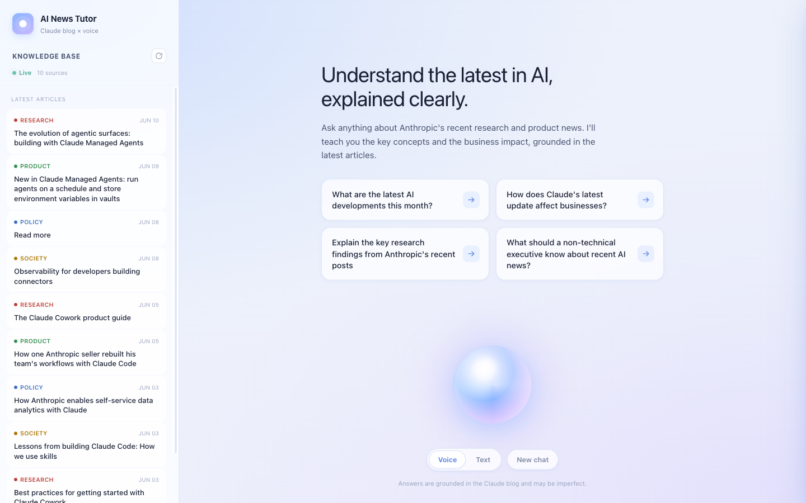
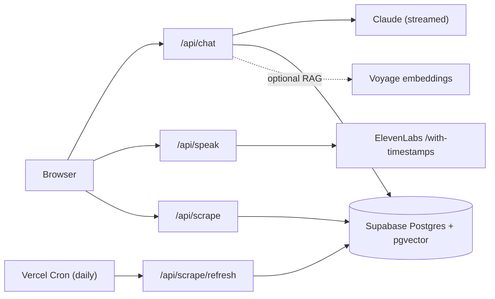

# AI News Tutor

**Understand the latest in AI — explained clearly, and read aloud.**

AI News Tutor is a conversational agent that turns the [Claude blog](https://claude.com/blog)'s latest posts into clear, on-demand explanations. Ask by voice or text. You can steer any answer to the level you want — high-level business impact or under-the-hood technical detail. Answers are streamed in and **read back aloud while the words highlight and the page follows along**, synced with ElevenLabs timestamps. Answer quality is gated by a [replayable eval harness](#evals--observability) with a committed baseline.

**▶ Try it live: [ai-tutor-elevenlabs.vercel.app](https://ai-tutor-elevenlabs.vercel.app)**

<!-- TODO: replace with a short GIF of the read-along (highlight + dim + follow-scroll, with voice) -->


---

## Quick start

Two keys and you're running — everything else is optional:

```bash
git clone https://github.com/uzampogn/ai-tutor-elevenlabs.git
cd ai-tutor-elevenlabs
npm install
cp .env.example .env.local      # set ANTHROPIC_API_KEY + ELEVENLABS_API_KEY
npm run dev                     # http://localhost:3000
```

| Key | Where to get it |
|---|---|
| `ANTHROPIC_API_KEY` | [console.anthropic.com/settings/keys](https://console.anthropic.com/settings/keys) |
| `ELEVENLABS_API_KEY` | [elevenlabs.io/app/settings/api-keys](https://elevenlabs.io/app/settings/api-keys) |

Without a database the app live-scrapes the blog on each request; without `VOYAGE_API_KEY` retrieval is off and answers are grounded in article summaries. Both are fine locally. Full configuration — database, cron refresh, RAG embeddings, Langfuse, production deploys — lives in [`docs/DEPLOYING.md`](./docs/DEPLOYING.md).

### Scripts

```bash
npm run dev          # dev server (http://localhost:3000)
npm run build        # production build
npm run start        # serve the production build
npm run lint         # next lint
npm run typecheck    # tsc --noEmit
npm run test         # vitest (watch)   ·   npm run test:run  (one-shot)
```

> ⚠️ Don't run `npm run build` while `npm run dev` is live — they share `.next` and the prod build corrupts the running dev server. Stop dev first.

---

## What it solves

AI moves faster than most people can keep up with, and the primary sources are written for builders. AI News Tutor closes that gap for founders, product managers, engineers — anyone curious about AI. Answers are grounded in current posts (refreshed daily, not a stale training cutoff), pitched at whatever level you ask for, read aloud so you can learn hands-free, and cited back to the exact articles they draw from.

## What it does

| | |
|---|---|
| 🗞️ **Live knowledge base** | Pulls every recent Claude blog post the index surfaces — title, date, and excerpt — into a browsable sidebar, refreshed automatically. |
| 💬 **Grounded answers** | Claude answers your question using those articles as context, streamed token-by-token, structured to scan. |
| 💼 **Business Impact takeaway** | Every answer closes with a one-line "so what does this mean" callout. |
| 🔗 **Source citations** | Articles referenced in an answer appear as chips linking to the posts. |
| 🔊 **Read aloud** | ElevenLabs voices every answer; a waveform animates while it speaks. |
| ✨ **Read-along** | The spoken sentence highlights and the view auto-scrolls to follow the voice. |
| 🎙️ **Talk to it** | Voice-first mode: tap the orb, speak your question, and it sends automatically. |
| 📰 **Article reader** | Click any article to open a slide-in reader with its summary. |

The app opens voice-first: a large, state-reactive orb invites you to tap and speak, the answer streams in, then plays back aloud with the current sentence highlighted and the page following along. A Text mode with a frosted-glass composer is one flip away.

---

## Read-along

AI News Tutor synchronizes the audio with the text: the spoken sentence highlights, already-spoken sentences dim, and the thread auto-scrolls to keep the active line in a comfortable reading band.

The engineering crux is that **the spoken text ≠ the rendered text**: the screen shows full markdown (bold, lists, a separate Impact card, source chips) while the voice engine times a plain string. AI News Tutor solves this with **one canonical tokenization** that is the single source of truth for both what gets spoken and what gets highlighted:

```
buildSpokenDoc(answer)   → canonical spoken text + stable sentence/word spans
        ▼
POST /api/speak          → ElevenLabs /with-timestamps → stitched audio + char-level timing
        ▼
buildTimings(...)        → per-sentence & per-word [start,end] windows (pure, with a fallback)
        ▼
useReadAlong(...)        → maps audio.currentTime → active sentence, highlights + follow-scrolls
```

It's built to be unobtrusive and accessible: highlighting toggles CSS classes on stable spans (never re-rendering, so screen readers aren't spammed), follow-scroll moves only on sentence changes (no jitter), `prefers-reduced-motion` is honored, and if timing data is ever missing the audio still plays and the text stays fully readable.

---

## How it works


```mermaid
flowchart LR
  Browser --> ChatAPI["/api/chat"]
  Browser --> SpeakAPI["/api/speak"]
  Browser --> ScrapeAPI["/api/scrape"]
  ChatAPI --> Claude["Claude (streamed)"]
  ChatAPI --> DB[("Supabase Postgres + pgvector")]
  ChatAPI -. "optional RAG" .-> Voyage["Voyage embeddings"]
  SpeakAPI --> XI["ElevenLabs /with-timestamps"]
  ScrapeAPI --> DB
  Cron["Vercel Cron (daily)"] --> Refresh["/api/scrape/refresh"]
  Refresh --> DB
```

All routes run server-side, so API keys never reach the browser.

| Route | Method | Purpose |
|---|---|---|
| `/api/scrape` | `GET` | Returns all recent Claude blog posts plus an ingestion `status` (freshness/staleness). Reads **DB-first** from Supabase Postgres (cold-start safe), with a short read-through cache. |
| `/api/scrape/refresh` | `GET` | Cron-only forced re-scrape — the **writer** that refreshes Postgres. Requires `Authorization: Bearer $CRON_SECRET` (401 otherwise). |
| `/api/chat` | `POST` | Injects the articles as context and streams Claude's answer. |
| `/api/speak` | `POST` | Strips markdown, chunks, calls ElevenLabs `/with-timestamps`, returns `{ audioBase64, alignment }` (`alignment.chars.join('') === text`). Fail-soft. |

**Freshness.** Supabase Postgres is the durable source of truth for the knowledge base. A daily Vercel Cron is the only writer: it scrapes, summarizes only new/changed posts (a content hash skips the rest), and upserts. Reads are DB-first and self-heal if the table is empty or stale, and a failed scrape serves the last-good rows while `/api/scrape` reports staleness. Details: [`docs/DEPLOYING.md`](./docs/DEPLOYING.md).

**Retrieval (optional).** With `VOYAGE_API_KEY` set, new/changed articles are embedded (`voyage-3.5-lite` → pgvector) and the chat retrieves the top-3 most similar into a second, uncached system block — the cached summaries block stays byte-identical, so prompt caching is preserved. Without the key the app falls back to summaries-only grounding.

```
src/
├── app/
│   ├── page.tsx · layout.tsx · globals.css   # shell, fonts, Aurora Mist tokens + CSS
│   └── api/{chat,scrape,speak}/              # Claude stream · blog scrape · ElevenLabs TTS
├── components/
│   ├── AppShell.tsx                          # root client component; owns all state
│   ├── AiRow.tsx                             # answer: body, Impact card, source chips, [data-s] spans
│   ├── main/                                 # InputDock, VoiceDock, Orb, Composer, Thread,
│   │   └── useReadAlong.ts                   #   useReadAlong (highlight + follow-scroll), STT hook
│   └── sidebar/                              # knowledge-base sidebar
└── lib/
    ├── scraper.ts · parseAnswer.ts · types.ts
    └── readAlong/                            # pure, unit-tested read-along core
        ├── spokenDoc.ts                      #   canonical tokenization (single source of truth)
        ├── stripMarkdown.ts                  #   markdown → spoken text
        └── timingMap.ts                      #   alignment → sentence/word time windows
```

Deploys to Vercel via GitHub Actions — pull requests get a preview URL, pushes to `main` promote to production ([`docs/DEPLOYING.md`](./docs/DEPLOYING.md)).

## Built with

| Layer | Technology |
|---|---|
| Framework | Next.js 14 (App Router), TypeScript |
| AI | Anthropic Claude — `claude-sonnet-4-6` (streamed) |
| Voice output | ElevenLabs TTS — `eleven_turbo_v2`, timestamped `/with-timestamps` |
| Voice input | ElevenLabs Scribe v2 Realtime (`scribe_v2_realtime`, WebSocket, server VAD) with browser Web Speech API fallback |
| Storage | Supabase Postgres (transaction pooler) — durable KB of articles + summaries |
| Design | "Aurora Mist" frosted-glass design system (custom CSS + Tailwind) |
| Tests | Vitest + Testing Library (jsdom) |
| Hosting | Vercel (auto-deployed via GitHub Actions) |

---

## Evals & observability

Answer quality is **measured, not vibed**. A Langfuse-backed harness replays a curated golden dataset through the *exact* production answer pipeline (`src/lib/answerPipeline.ts`) and scores every answer, so a prompt/retrieval/citation tweak that quietly degrades quality fails a gate instead of shipping. Full design: [`spec/eval-harness/spec.md`](./spec/eval-harness/spec.md) · managed-evaluator setup: [`spec/eval-harness/langfuse-setup.md`](./spec/eval-harness/langfuse-setup.md).

**What it measures — three metric groups:**

| Group | Metrics |
|---|---|
| **Retrieval** (deterministic) | recall@3, precision@3, MRR vs. expected source slugs; off-topic items invert (pass ⇔ retrieval returns empty, validating `SIM_FLOOR`) |
| **Citation integrity** (deterministic, reuses `parseAnswer.ts`) | every `[n]` marker in-range, zero markers when nothing was retrieved, cited-source coverage, markers survive the read-aloud glue/strip round-trip |
| **Answer quality** (LLM-as-judge, `claude-sonnet-4-6`) | groundedness, citation faithfulness, relevance, pedagogy — each 1–5 with a rationale |

**Commands:**

```bash
npm run eval:seed     # generate candidate items from digest.questions[] → eval/dataset.json (merges; never clobbers hand-edits)
npm run eval:push     # upload curated items to the Langfuse dataset (rag-golden)
npm run eval          # run the harness live vs. the golden dataset → scores + baseline diff (exit 1 on regression)
npm run eval:accept   # re-bless: copy the latest run's aggregates into eval/baseline.json (a deliberate, reviewable git diff)
```

**Baseline gate.** `eval/baseline.json` is committed. `npm run eval` prints a baseline-vs-current diff table and exits non-zero if any metric drops below `baseline − tolerance` (deterministic tolerance ≤0.02; judge dimensions 0.3 to absorb LLM noise). Run it before merging changes that touch retrieval, prompts, or citations; when a change legitimately moves the numbers, re-baseline with `npm run eval:accept` so the shift lands as a reviewable diff. `npm run eval` is a live-API run (real tokens, needs `ANTHROPIC_API_KEY` + a Postgres `DATABASE_URL` for retrieval) and is never part of `npm run test:run` — the offline `src/lib/eval/*` modules are unit-tested in the normal Vitest gate.

> **Node 22 for eval scripts.** Run `eval:seed`/`eval` on **Node 22**, not 24: under Node 24 the pinned `@anthropic-ai/sdk` falls back to a bundled `node-fetch@2` whose gzip stream aborts requests (`ERR_STREAM_PREMATURE_CLOSE`); Node 22's native `fetch` works (spec.md §3).

**Observability.** Every production chat turn is traced to Langfuse (trace `chat` → `retrieval` span + `generation` observation with token usage), and a Faithfulness LLM evaluator (project-scoped copy of the RAGAS template, judged by `claude-sonnet-4-6`) samples 20% of live `chat` traces via the `faithfulness-prod-chat` evaluation rule — setup details and verification status in [`spec/eval-harness/langfuse-setup.md`](./spec/eval-harness/langfuse-setup.md). The `LANGFUSE_PUBLIC_KEY` / `LANGFUSE_SECRET_KEY` / `LANGFUSE_BASE_URL` env vars are optional; unset ⇒ tracing and evals are silent no-ops.

---

## Why these choices

- **Summaries-grounding by default, RAG as an optional layer.** The app is useful with two API keys; every extra dependency (database, Voyage, Langfuse) degrades to a no-op instead of being a hard requirement.
- **DB-first reads.** Serverless cold starts read precomputed rows instead of re-scraping the blog and re-issuing ~24 summary calls.
- **One canonical tokenization for speech and highlighting.** A single source of truth is what keeps ElevenLabs audio timing and rendered markdown in sync — see [Read-along](#read-along).

## Limitations & what's next

Current limitations:

- The knowledge base covers a single source — the Claude blog — refreshed once a day.
- Voice input needs an ElevenLabs key; the fallback is the browser Web Speech API (Chrome/Edge only).

Next up:

- A smaller orb, leaving more room for the text.
- Harmonized orb state colours (red → green).
- Email yourself a conversation transcript with a high-level summary.
- Back the article drawer with Postgres to cut cold-start time.

---

## Design

The editorial **Aurora Mist** visual system — soft frosted-glass surfaces on a clean white canvas — is documented in [`ui-design-mockup/`](./ui-design-mockup/) (`AI News Tutor.html` is the visual source of truth; `SPEC.md` maps each screen to its components).
