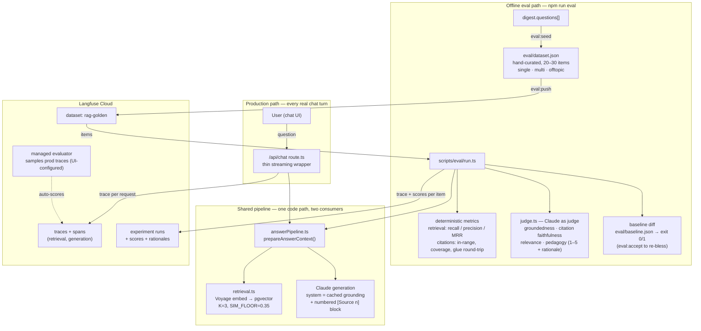
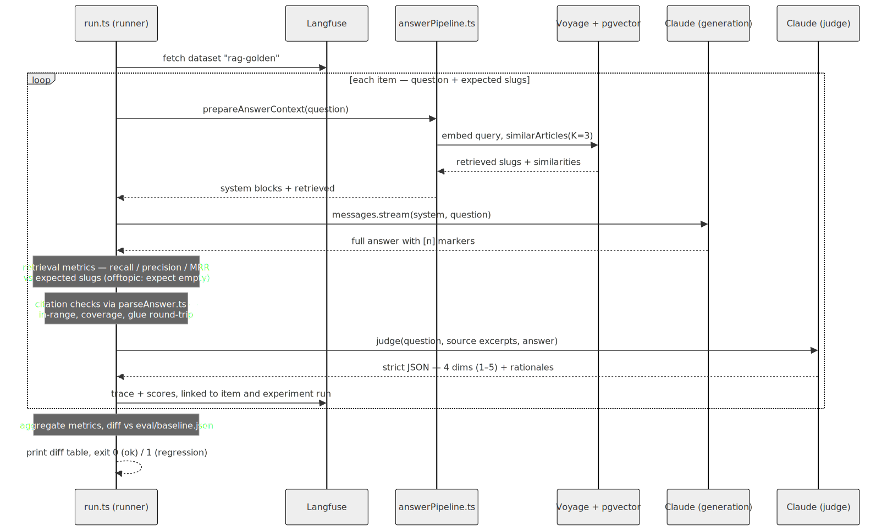
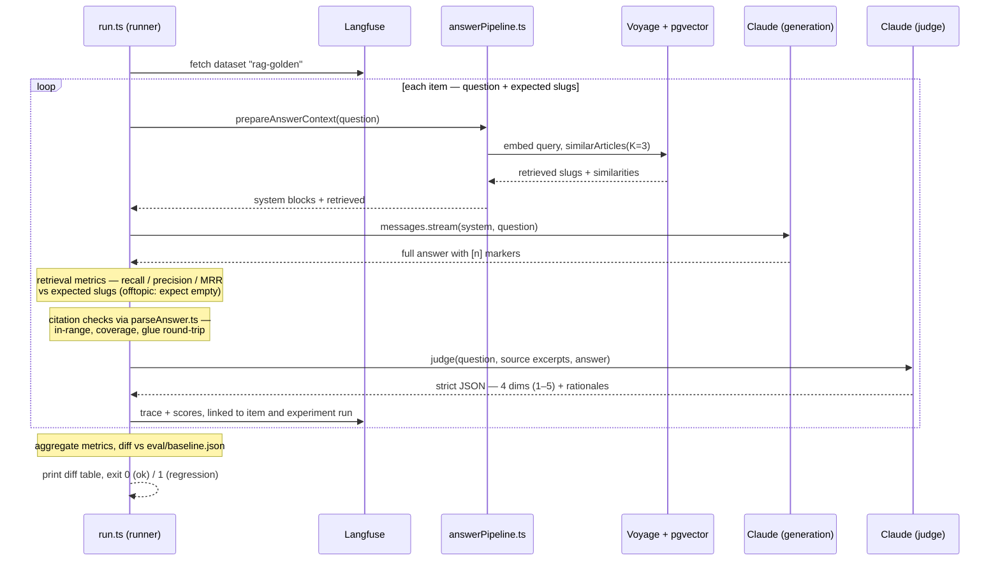

# Eval Harness / Quality Scoring — Langfuse-backed (backlog #9)

**Status:** Spec approved, awaiting implementation plan
**Origin:** `spec/00_feature_backlog.md` item 9 — "Answers stay reliably good and don't silently regress as the app grows — quality is measured, not vibed." Intermediate signal: eval-driven development.
**Branch:** builds on top of `feat/rag-02-inline-citations` (citation metrics score exactly what that branch produces)
**Touch surface:**
- `src/app/api/chat/route.ts` (refactor: extract prompt assembly, add tracing)
- `src/lib/answerPipeline.ts` (new — extracted pipeline)
- `src/lib/langfuse.ts` (new — no-op-degrading client singleton)
- `scripts/eval/seedDataset.ts`, `scripts/eval/pushDataset.ts`, `scripts/eval/run.ts` (new)
- `src/lib/eval/` (new — metrics, judge, baseline modules + tests)
- `eval/dataset.json`, `eval/baseline.json` (new — committed artifacts)
- `package.json` (scripts: `eval`, `eval:accept`, `eval:seed`, `eval:push`)
- `spec/eval-harness/langfuse-setup.md` (new — managed-evaluator setup steps, written during implementation)
- `.env.example` (Langfuse keys), `README.md`, `CLAUDE.md`

## Why now

RAG retrieval + inline citations (#2) is landing. Its quality knobs (`RETRIEVAL_K`, `SIM_FLOOR`, prompt-block wording, citation instructions) currently have no feedback loop — a prompt tweak that quietly breaks groundedness or citation accuracy would ship unnoticed, because existing Vitest coverage asserts prompt *structure*, not answer *quality*. Backlog items 3 and 5 will multiply the surfaces that can regress. The harness also carries an explicit learning goal: hands-on use of the Langfuse product (SDK **and** UI).

## Decisions

| Decision | Choice | Rationale |
|---|---|---|
| Eval scope (v1) | Full pipeline: retrieval + citation integrity + answer quality | Complete "quality is measured" story from day one; costs are trivial at this dataset size |
| Platform | Langfuse Cloud (free tier), EU region | Learning goal; datasets/experiments/scores/trace UI out of the box; keys via env |
| Integration depth | Offline evals **and** production tracing of `/api/chat` | Real traffic becomes inspectable traces; prod traces are manually promotable into the dataset later |
| Pipeline execution | In-process: extract `answerPipeline.ts`, runner imports it | Eval exercises the exact prod code path; no server needed; refactor is a code-health win (prompt assembly leaves the route handler) |
| Golden dataset | Hybrid: seed from `digest.questions[]`, hand-curate to ~20–30 items | Digest questions carry a free retrieval label (their source article); curation adds multi-source + off-topic/adversarial cases generation can't produce |
| Judge | In-repo TypeScript judge (offline runs) **plus** Langfuse managed evaluator (prod trace sampling) | In-repo: versioned, PR-reviewable, testable. Managed evaluator: learn that product surface; continuous prod scoring for free |
| Judge model | `claude-sonnet-4-6` default, `EVAL_JUDGE_MODEL` override | Judge reliability over cost at ~25 items; mirrors `DIGEST_MODEL` override pattern |
| Regression signal | Committed `eval/baseline.json`; per-metric diff with tolerances; non-zero exit on regression; explicit `eval:accept` to re-baseline | Catches "still above floor but dropped 15%" drift; baseline changes are deliberate, reviewable git diffs |
| Run trigger | Local CLI (`npm run eval`) before merging RAG-touching changes | No CI test infra exists today; deliberate token spend; CI job deferred (non-goal) |

## Architecture

Two consumers (the production route and the offline eval runner) share one extracted pipeline; both report into Langfuse, which is where quality becomes visible.

Diagram source (Mermaid)

Reading guide: the **production path** (top-left) only gains tracing — behavior is unchanged. The **eval path** replays curated questions through the *same* shared pipeline, so a score regression can only come from a real code/prompt/data change, never from eval-only drift. Langfuse holds all four artifacts: the golden dataset, prod traces (sampled and auto-scored by the managed evaluator), and offline experiment runs with their scores.

### 1. Pipeline extraction — `src/lib/answerPipeline.ts`

Prompt-assembly logic moves out of `route.ts`:

- `prepareAnswerContext(messages): Promise<{ system: SystemBlock[]; retrieved: SimilarArticleRow[] }>` — latest-user-message extraction, `retrieveArticles`, `getGroundingContext`, `buildRetrievedBlock`, cache-control placement. Byte-identical system output to today's route.
- Shared constants exported: `CHAT_MODEL`, `CHAT_MAX_TOKENS`.
- `route.ts` becomes a thin wrapper: call `prepareAnswerContext`, open the same `client.messages.stream(...)`, stream deltas, set `X-Sources`. Behavior unchanged.
- The eval runner calls the same function, opens the same `.stream()`, and awaits `finalMessage()` — one code path, two consumers.

### 2. Langfuse client + prod tracing — `src/lib/langfuse.ts`

- Singleton following the `embeddings.ts` degradation pattern: `LANGFUSE_PUBLIC_KEY` / `LANGFUSE_SECRET_KEY` / `LANGFUSE_BASE_URL` unset → client is a silent no-op; app behavior identical to today.
- Chat route: one trace per request. Spans: **retrieval** (input: question; output: slugs + similarities; metadata: `K`, `SIM_FLOOR`) and **generation** (model, token usage incl. cache read/write, latency). Trace output: final answer text + `X-Sources` slugs.
- Serverless flush: events flushed via `after()` (Next.js) so responses are never delayed; tracing errors are caught and logged, never thrown into the chat path.

### 3. Golden dataset — `scripts/eval/` + `eval/dataset.json`

- `eval:seed` — generates candidate items from each article's `digest.questions[]` into `eval/dataset.json` (source article slug = expected retrieval label). Idempotent; never overwrites hand-edits (merges by question hash, marks new candidates `"curated": false`).
- Hand-curation pass (human): fix labels, prune weak questions, add **multi-source** questions (expected slugs spanning ≥2 articles) and **off-topic/adversarial** questions (expected: empty retrieval). Target 20–30 items, each `"curated": true`.
- `eval:push` — uploads curated items to a Langfuse dataset (name: `rag-golden`, item metadata carries `kind: single | multi | offtopic`). Re-push upserts by question hash.
- Item shape: `{ input: { question }, expectedOutput: { slugs: string[] }, metadata: { kind, curated } }`.

### 4. Eval runner — `scripts/eval/run.ts` (`npm run eval`)

Per item: fetch from Langfuse dataset → `prepareAnswerContext` → generation (live Anthropic) → deterministic metrics → judge call → push trace + scores linked to the dataset item and an experiment run named `eval-<git-sha>-<n>`.

Life of one eval item:

Diagram source (Mermaid)

**Metric group 1 — retrieval (deterministic):** recall@3, precision@3, MRR vs `expectedOutput.slugs`. `offtopic` items invert: pass ⇔ retrieval returns empty (validates `SIM_FLOOR`).

**Metric group 2 — citation integrity (deterministic, reuses `parseAnswer.ts`):**
- every `[n]` marker in-range (`n ≤ retrieved.length`)
- zero markers when nothing was retrieved
- cited-source coverage (share of retrieved sources actually cited)
- markers survive the `glueCitations` → strip round-trip (read-aloud alignment invariant)

**Metric group 3 — LLM judge (in-repo, `src/lib/eval/judge.ts`):** one call per item; prompt contains the question, the exact source excerpts given to the generator, and the answer. Strict JSON out; four 1–5 dimensions, each with a rationale (pushed as Langfuse score comments):

| Dimension | Judge question |
|---|---|
| Groundedness | Claims supported by the provided excerpts, not outside knowledge? |
| Citation faithfulness | Does each `[n]`-cited source actually support its sentence? |
| Relevance | Does the answer address the asked question? |
| Pedagogy | Clear, well-structured, tutor-appropriate depth? |

**Run summary:** per-metric aggregates (mean; failure counts) printed as a table and attached to the experiment run.

### 5. Baseline gate — `eval/baseline.json`

- Committed JSON: `{ runName, acceptedAt: <git sha>, metrics: { <name>: { value, tolerance } } }`.
- After each run the CLI prints a baseline-vs-current diff table; any metric dropping below `baseline − tolerance` → verdict FAIL → exit 1.
- Tolerances: deterministic metrics 0–0.02; judge dimensions 0.3 (absorbs LLM noise).
- `npm run eval:accept` copies the latest run's aggregates into `eval/baseline.json` — a deliberate, reviewable git diff.
- First-ever run (no baseline file) reports scores and exits 0 with a "no baseline" notice.

### 6. Managed evaluator (Langfuse UI — documented setup, no code)

- Anthropic LLM connection configured in Langfuse project settings.
- One evaluator from the groundedness template, sampling production `/api/chat` traces (sampling rate set in UI; low, e.g. 10–20%).
- Setup steps documented in `spec/eval-harness/langfuse-setup.md` during implementation.

## Error handling

- A failed item (network error, per-item timeout, judge JSON unparseable after one retry) is recorded as `failed`, run continues.
- \>20% failed items → runner refuses a baseline verdict (exit 1 with "run incomplete", no pass/fail table).
- Langfuse flush in `finally` — crashed runs still show partial traces.
- Prod tracing wrapper never throws into the chat path (catch + `console.warn`).
- Eval performs **reads only** against Supabase (retrieval queries); the serialized-sql constraint on embedding writes is not in play.

## Hard constraints (must not break)

- `/api/chat` behavior byte-identical after extraction: system blocks (incl. `cache_control` placement), streaming, `X-Sources` header.
- App fully functional with no `LANGFUSE_*` keys set (local dev, CI, forks).
- `npm run test:run` stays offline — no live API calls in the Vitest suite; `npm run eval` is never part of the quality gate.
- Read-aloud alignment invariant: eval must not require changes to `stripMarkdown.ts` / `glueCitations` semantics.

## Testing (Vitest)

| Suite | Cases |
|---|---|
| `src/lib/answerPipeline.test.ts` | system blocks byte-identical to previous route assembly (cached block 1, retrieved block 2 iff retrieved non-empty); constants exported; existing `route.test.ts` assertions keep passing against the thin wrapper |
| `src/lib/eval/retrievalMetrics.test.ts` | recall/precision/MRR table-driven cases; empty expected; offtopic inversion; slug-order independence |
| `src/lib/eval/citationMetrics.test.ts` | in-range/out-of-range markers; no-retrieval ⇒ no-marker rule; coverage ratio; glue/strip round-trip |
| `src/lib/eval/judge.test.ts` | prompt builder includes question/excerpts/answer; strict-JSON parse; malformed JSON → one retry → failed item; SDK mocked via existing `vi.mock('@anthropic-ai/sdk')` convention |
| `src/lib/eval/baseline.test.ts` | tolerance edges (exactly at, just below); improvement; new metric absent from baseline; missing baseline file |
| `src/lib/langfuse.test.ts` | keys unset ⇒ no-op (no network, no throw); trace helper catches internal errors |
| `scripts/eval/seedDataset` logic | merge-by-hash preserves hand-edits; `curated` flag untouched on re-seed |

## Definition of Done

| Check | Criterion |
|---|---|
| Quality gate | `npm run lint` + `npm run typecheck` + `npm run test:run` all green |
| Route parity | Existing `route.test.ts` passes unmodified (or with mechanical import updates only) |
| Prod tracing | A live chat turn produces a Langfuse trace with retrieval + generation spans and token usage |
| Dataset | ≥20 curated items incl. ≥3 multi-source and ≥3 off-topic, visible in the Langfuse dataset UI |
| Eval run | `npm run eval` completes, experiment run visible in Langfuse with per-item traces + scores + judge rationales |
| Regression gate | Manually degrading `SIM_FLOOR` (e.g. 0.9) makes `npm run eval` fail with a readable diff table; reverting passes |
| Baseline | `eval/baseline.json` committed via `npm run eval:accept` |
| Managed evaluator | Groundedness evaluator active on sampled prod traces; setup documented |
| Docs | `README.md` + `CLAUDE.md` updated (env vars, eval commands, when to run) |

## Sequencing

1. Extract `answerPipeline.ts`; route becomes thin wrapper (green gate, zero behavior change)
2. `langfuse.ts` client + prod tracing spans (green gate; verify a live trace)
3. Dataset: seed → hand-curate → push (`eval/dataset.json` committed)
4. Runner: pipeline execution + deterministic metrics + judge + Langfuse experiment linking
5. Baseline gate + `eval:accept`; commit first baseline
6. Managed evaluator UI setup + `langfuse-setup.md`; README/CLAUDE.md updates

Each step lands independently green. Steps 1–2 can merge before the dataset exists.

## Non-goals (YAGNI)

- No CI eval job in v1 (CI currently runs zero tests; a `workflow_dispatch` action is a natural v1.5 once the baseline stabilizes)
- No TTS / read-along quality scoring
- No automatic promotion of prod traces into the golden dataset (manual promotion via Langfuse UI)
- No Langfuse prompt management (prompts stay in code)
- No eval of the digest pipeline itself (its output is scaffolding here, not the subject)
- No retrieval-parameter sweeps / auto-tuning (the harness makes manual sweeps possible; automation is out of scope)
